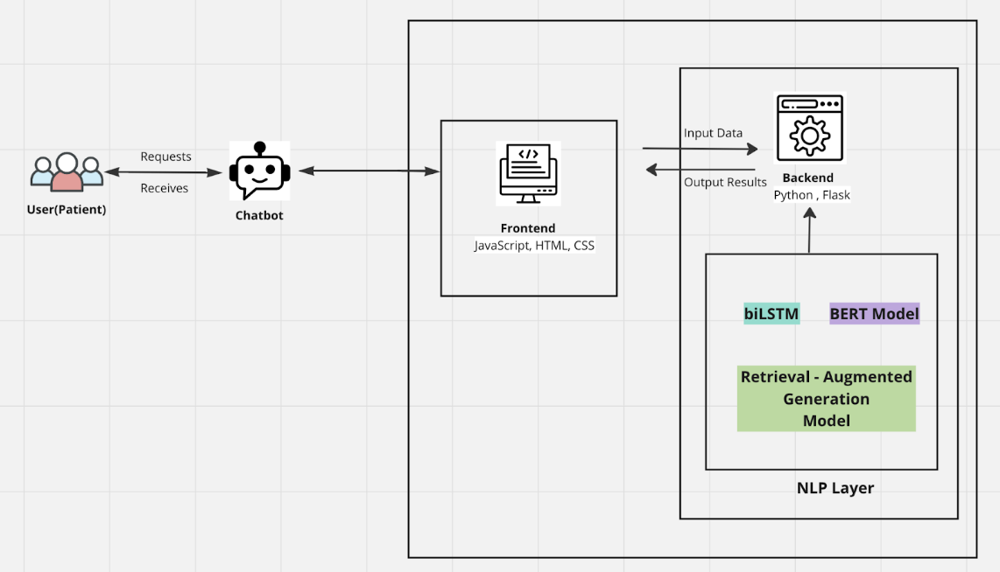

# Medical Chatbot for Patients

## Contents
- [Introduction to Team Members](#introduction-to-team-members)
- [Introduction](#introduction)
- [Problem Statement](#problem-statement)
- [Motivation](#motivation)
- [Solution Requirements](#solution-requirements)
- [System Architecture (Framework)](#system-architecture-framework)
- [Experimental Design (Methodology)](#experimental-design-methodology)
  - [Data Collection and Preprocessing](#data-collection-and-preprocessing)
  - [Model Development](#model-development)
  - [Implementation and Testing](#implementation-and-testing)
  - [Evaluation](#evaluation)
  - [Deployment](#deployment)
- [Project Management](#project-management)
  - [Task Distribution](#task-distribution)
- [Dataset Information](#dataset-information)
- [Paper Summary by Team Members](#paper-summary-by-team-members)

## Introduction to Team Members
- Sonu Adhikari – st124409
- Ashmita Phuyal – st124454
- Sai Haneesha Bestha – st124089
- Md Shafi Ud Doula – st124047
- Tanzil Al Sabah – st123845

## Introduction
Medical chatbots, powered by AI technology, provide personalized and convenient access to medical information and services, acting as virtual assistants for users(patients). They offer immediate responses to inquiries, guidance on health issues and medication management. This chatbot utilizes NLP techniques and vast medical data to enhance precision, empower users to seek accurate medical advice, make informed decisions, and access reliable healthcare information efficiently.

The key factors behind medical chatbots include scalability, availability, data collection, instant information provision, and cost efficiency.
- Scalability: Efficiently handles increased demand without compromising quality
- Availability: Provides 24/7 instant support for patients
- Data Collection: Analyzes patient data for informed insights and personalized care
- Instant Information: Offers rapid and accurate responses to inquiries
- Cost Efficiency: Optimizes operations, reduces costs, and streamlines tasks

## Problem Statement
- Limited Access to Healthcare Professionals: Long wait times for appointments,overburdened healthcare systems, geographical barriers and financial constraints results in the limited access to healthcare professionals
- Delayed Medical Attention: Lack of awareness or understanding of the seriousness of symptoms contributes to delayed medical attention, especially in case of Cancer.
- Technological problems: Traditional chatbots were rule-based and had limited understanding of natural languages and inability to learn and adapt which resulted in limited accuracy.

## Motivation
By addressing the challenges mentioned, the chatbot aims to achieve the following objectives:
- Empower users to make informed decisions about their health and medical conditions, enhancing overall health literacy and promoting proactive healthcare management.
- Provide a convenient and efficient platform for users to access medical information anytime, anywhere, facilitating timely decision-making and intervention in healthcare matters.
This project will serve as a practical application of the concepts studied in the NLP course and reinforce our learning and showcasing the real-world relevance of the technologies and strategies employed in improving healthcare accessibility and patient outcomes.

## Solution Requirements
- Advanced NLP for enhanced user query understanding and response accuracy
- Comprehensive medical knowledge base for up-to-date information
- Experiments conducted to identify the optimal model for paraphrasing
- Seamless integration with web application for enhanced functionality
- User-friendly interface for improved user experience
- Incorporate advanced NLP models such as RAG model
- Research carried out to determine which factors affects the accuracy of the model performance

## System Architecture (Framework)
 

## Experimental Design (Methodology)
### Data Collection and Preprocessing
- Sources: Leverage the MedQuad dataset and supplementary datasets from Huggingface and GitHub.
- Preprocessing Steps: Perform tokenization, numericalization, and data cleansing to ensure high-quality input data.

### Model Development
- Model Selection and Training: Utilize NLP models such as biLSTM, BERT, and RAG models. Focus on domain-specific models like ClinicalBERT for nuanced medical understanding. Integrate advanced NLP techniques like contrastive learning for performance optimization.

### Implementation and Testing
- Paraphrase Generation: Deploy LSTM or comparable models for diverse paraphrase generation. Employ a dual-focus training strategy encompassing both broad and medical-specific language datasets.

### Evaluation
- Metrics: Use BLEU, ROGUE, MRR, and model-based metrics like BERTScore for a multidimensional evaluation of paraphrases. Extend evaluation to precision, recall, and F1-score for a robust assessment of medical advice relevance and accuracy.

### Deployment
- Web Application Integration: Develop the backend with Flask and craft a user-friendly frontend with HTML, CSS, and JavaScript, ensuring the chatbot is accessible and easy to navigate.

## Project Management
### Task Distribution
| SN | Tasks | Subtasks | Assignee |
|----|-------|----------|----------|
| 1 | Data Collection | Research/Background study for data selection | Sonu & Ashmita |
| | | Data Cleansing | Haneesha & Shafi |
| 2 | Data Preprocessing | Tokenization/Numericalization | Tanzil & Haneesha |
| 3 | Research on Models | Research | All team members |
| 4 | Model Selection and Training | Experiment with different models | Ashmita & Shafi |
| 5 | Evaluation | | Sonu & Tanzil |
| 6 | Frontend/Backend | | Haneesha & Ashmita |
| 8 | Integration/Testing | | Shafi & Tanzil |
| 9 | Deployment | | Sonu & Haneesha |
| 10 | Documentation | | Tanzil & Ashmita |

## Dataset Information
- HuggingFace Dataset: [https://huggingface.co/datasets/Amirkid/MedQuad-dataset](https://huggingface.co/datasets/Amirkid/MedQuad-dataset)
- Github Dataset: [https://github.com/abachaa/MedQuAD?tab=readme-ov-file](https://github.com/abachaa/MedQuAD?tab=readme-ov-file)

## Paper Summary by Team Members
[Summaries for each paper and team member contributions]
