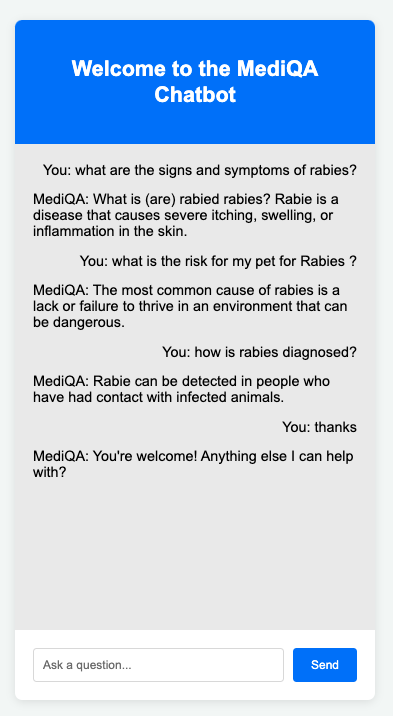
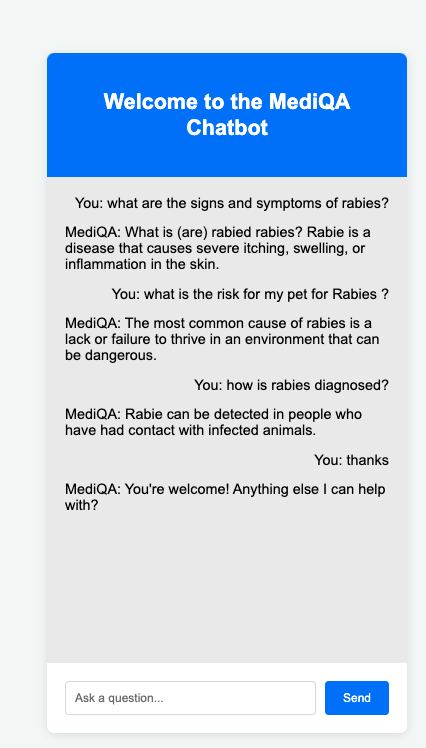
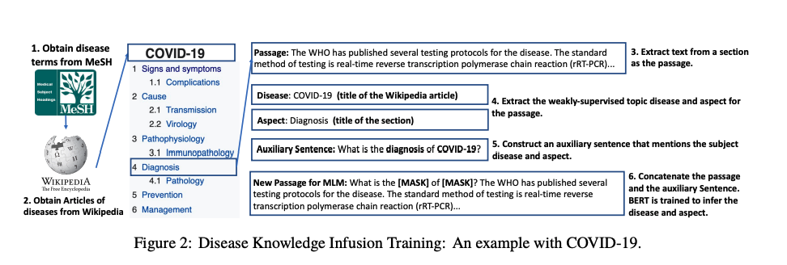
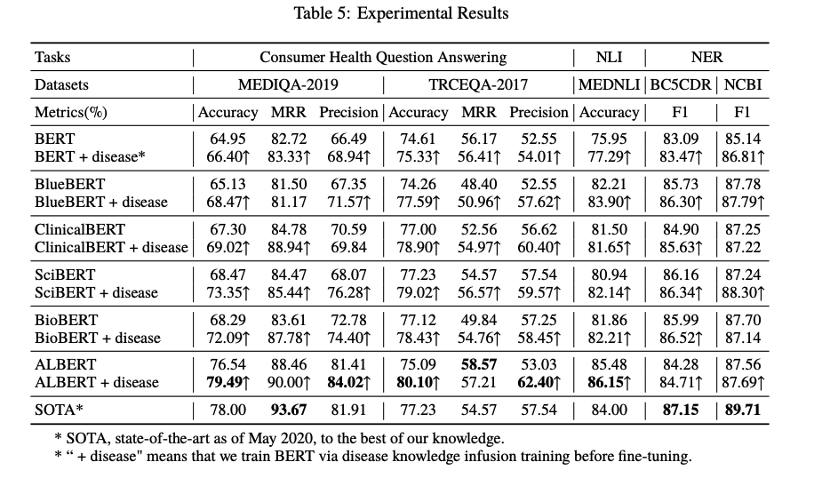
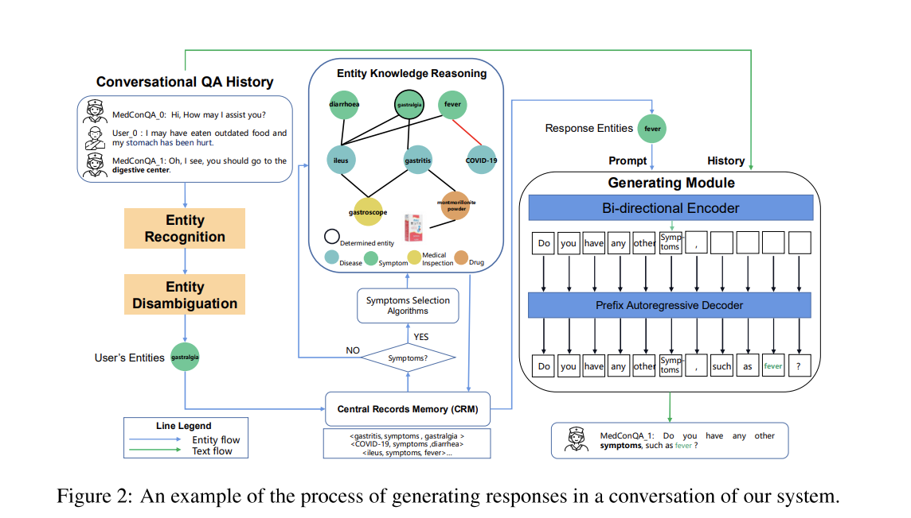

# Medical Chatbot for Patients

This repository details the development of a Medical Chatbot designed to provide patients with personalized and immediate access to medical information and services, utilizing AI and NLP techniques.

## Contents
- [Team Members](#team-members)
- [Introduction](#introduction)
- [Problem Statement](#problem-statement)
- [Motivation](#motivation)
- [Solution Requirements](#solution-requirements)
- [System Architecture (Framework)](#system-architecture-framework)
- [Experimental Design (Methodology)](#experimental-design-methodology)
  - [Data Collection and Preprocessing](#data-collection-and-preprocessing)
  - [Model Development](#model-development)
  - [Implementation and Testing](#implementation-and-testing)
  - [Evaluation](#evaluation)
  - [Deployment](#deployment)
- [Project Management](#project-management)
  - [Task Distribution](#task-distribution)
- [Dataset Information](#dataset-information)
- [Paper Summary by Team Members](#paper-summary-by-team-members)

## Team Members
- Sonu Adhikari – st124409
- Ashmita Phuyal – st124454
- Sai Haneesha Bestha – st124089
- Md Shafi Ud Doula – st124047
- Tanzil Al Sabah – st123845

## Introduction

### Project Background
Medical chatbots, powered by AI technology, provide personalized and convenient access to medical information and services, acting as virtual assistants for users(patients). They offer immediate responses to inquiries, guidance on health issues and medication management. This chatbot utilizes NLP techniques and vast medical data to enhance precision, empower users to seek accurate medical advice, make informed decisions, and access reliable healthcare information efficiently.

## Motivation
By addressing the challenges mentioned, the chatbot aims to achieve the following objectives:
- Empower users to make informed decisions about their health and medical conditions, enhancing overall health literacy and promoting proactive healthcare management.
- Provide a convenient and efficient platform for users to access medical information anytime, anywhere, facilitating timely decision-making and intervention in healthcare matters.
This project will serve as a practical application of the concepts studied in the NLP course and reinforce our learning and showcasing the real-world relevance of the technologies and strategies employed in improving healthcare accessibility and patient outcomes.

## Problems and Solutions

### Problems
- Limited Access to Healthcare Professionals: Long wait times for appointments,overburdened healthcare systems, geographical barriers and financial constraints results in the limited access to healthcare professionals
- Delayed Medical Attention: Lack of awareness or understanding of the seriousness of symptoms contributes to delayed medical attention, especially in case of Cancer.
- Technological problems: Traditional chatbots were rule-based and had limited understanding of natural languages and inability to learn and adapt which resulted in limited accuracy.

### Solutions
The key factors to deploy medical chatbots include scalability, availability, data collection, instant information provision, and cost efficiency.
- Scalability: Efficiently handles increased demand without compromising quality
- Availability: Provides 24/7 instant support for patients
- Data Collection: Analyzes patient data for informed insights and personalized care
- Instant Information: Offers rapid and accurate responses to inquiries
- Cost Efficiency: Optimizes operations, reduces costs, and streamlines tasks

## Solution Requirements
- Advanced NLP for enhanced user query understanding and response accuracy
- Comprehensive medical knowledge base for up-to-date information
- Experiments conducted to identify the optimal model for paraphrasing
- Seamless integration with web application for enhanced functionality
- User-friendly interface for improved user experience
- Incorporate advanced NLP models such as RAG model
- Research carried out to determine which factors affects the accuracy of the model performance

## System Architecture (Framework)
 

## Experimental Design (Methodology)
### Data Collection and Preprocessing
- Sources: Leverage the MedQuad dataset and supplementary datasets from Huggingface and GitHub.
- Preprocessing Steps: Perform tokenization, numericalization, and data cleansing to ensure high-quality input data.

### Model Development
- Model Selection and Training: Used  models such as Seq2Seq,T5,Bert,GPT2 models for better performance.
- Integrate advanced NLP techniques like validation and perplexity,adaptation validation seq2seq for high quality performance.

### Implementation and Testing
- After finalizing the better performing model ,utilize it for modeling.
- We have also Fine-tuned the model on medical question-answering (QA) data with GPT2 model.

### Evaluation (Future Task)
- Metrics: Use BLEU, ROGUE, MRR, and model-based metrics like BERTScore for a multidimensional evaluation of paraphrases. 
- Extend evaluation to precision, recall, and F1-score for a robust assessment of medical advice relevance and accuracy.

### Deployment
- Web Application Integration: Develop an user-friendly web application using Dash/Flask, ensuring the chatbot is accessible and easy to navigate.

 

 

## Project Management
### Task Distribution
| SN | Tasks | Subtasks | Assignee |
|----|-------|----------|----------|
| 1 | Data Collection | Research/Background study for data selection | Sonu & Ashmita |
| | | Data Cleansing | Haneesha & Shafi |
| 2 | Data Preprocessing | Tokenization/Numericalization | Tanzil & Haneesha |
| 3 | Research on Models | Research | All team members |
| 4 | Model Selection and Training | Experiment with different models | Ashmita & Shafi |
| 5 | Evaluation | | Sonu & Tanzil |
| 6 | Frontend/Backend | | Haneesha & Ashmita |
| 8 | Integration/Testing | | Shafi & Tanzil |
| 9 | Deployment | | Sonu & Haneesha |
| 10 | Documentation | | Tanzil & Ashmita |

## Dataset Information
- HuggingFace Dataset: [https://huggingface.co/datasets/Amirkid/MedQuad-dataset](https://huggingface.co/datasets/Amirkid/MedQuad-dataset)
- Github Dataset: [https://github.com/abachaa/MedQuAD?tab=readme-ov-file](https://github.com/abachaa/MedQuAD?tab=readme-ov-file)

## Paper Summary by Team Members

## Table of Contents
1. [Sonu Adhikari](#sonu-adhikari)
    - [MedConQA: Medical Conversational Question Answering System based on Knowledge Graphs](#medconqa-medical-conversational-question-answering-system-based-on-knowledge-graphs)
    - [Evaluation of the Clinical Question Answering Presentation](#evaluation-of-the-clinical-question-answering-presentation)
  
2. [Ashmita Phuyal](#ashmita-phuyal)
    - [Incorporating Medical Knowledge in BERT for Clinical Relation Extraction](#incorporating-medical-knowledge-in-bert-for-clinical-relation-extraction)
    - [Infusing Disease Knowledge into BERT for Health Question Answering, Medical Inference, and Disease Name Recognition](#infusing-disease-knowledge-into-bert-for-health-question-answering-medical-inference-and-disease-name-recognition)
  
3. [Tanzil Al Sabah](#tanzil-al-sabah)
    - [How You Ask Matters: The Effect of Paraphrastic Questions to BERT Performance on a Clinical SQuAD Dataset](#how-you-ask-matters-the-effect-of-paraphrastic-questions-to-bert-performance-on-a-clinical-squad-dataset)
    - [Answering Clinical Questions with Role Identification](#answering-clinical-questions-with-role-identification)
  
4. [Md Shafi Ud Doula](#md-shafi-ud-doula)
    - [Infusing Disease Knowledge into BERT for Health Question Answering, Medical Inference, and Disease Name Recognition](#infusing-disease-knowledge-into-bert-for-health-question-answering-medical-inference-and-disease-name-recognition)
    - [MedConQA: Medical Conversational Question Answering System](#medconqa-medical-conversational-question-answering-system)

5. [Sai Haneesha Bestha](#sai-haneesha-bestha)
    - [Recognizing Question Entailment (RQE) and Natural Language Inference (NLI) methods](#recognizing-question-entailment-rqe-and-natural-language-inference-nli-methods)
    - [Fine-Tuning PEGASUS for Consumer Health Question Summarization](#fine-tuning-pegasus-for-consumer-health-question-summarization)

---
### Sonu Adhikari
#### MedConQA: Medical Conversational Question Answering System based on Knowledge Graphs
- **Link:** [https://aclanthology.org/2022.emnlp-demos.15/](https://aclanthology.org/2022.emnlp-demos.15/)
- **Summary:** Conversational Question Answering is the natural evolution of traditional question answering systems. It can improve the experience by providing the natural flow of conversation. 
There are several problems with existing systems like Single reply function and difficult to scale,Rule-based systems are monotonous and lack expertise,Ensuring a safe and controllable response is also a challenge since medical is a sensitive domain.The MedConQA implements pipeline manner for automating medical procedures. Multiple modules are integrated into the system such as medical consultation, medical triage, drug recommendation etc. Several advanced technologies such as medical entity disambiguation and response generation. It is competitive compared to other SOTA technologies in the medical dialogue system.
The preliminary experiment has been carried out in a hospital in China. The whole process includes symptom consultation and triage, disease confirmation and dialogue generation.
CMCQA https://github.com/WENGSYX/CMCQA?tab=readme-ov-file  and CMKG https://github.com/WENGSYX/CMKG?tab=readme-ov-file data has been used. The model has been trained using Pytorch and Hugging Face framework. During training, adamW optimiser has been used. The Learning rate is 1e-5 with warm-up. Similarly, Four 3090 GPUs have been used.For evaluation, both automatic and human evaluation has been used in this paper. The Evaluation metrics used are F1, BLEU, Dist. scores ( F1- reflects correctness of medical entity knowledge,BLEU - relativity of generated responses, Dist. score - diversity of the generated responses).For human evaluation, 100 samples from test datasets have been randomly picked.Each generated sentence is scored from 1 to 5(1 being the worst) by three independent people with medical background. Results from the evaluation demonstrate the effectiveness of the proposed system in addressing the identified limitations. The paper concludes by highlighting the significance of MedConQA in improving medical dialogue systems and providing resources such as code, datasets, and tools to advance future research in this area.
Application website: https://www.chunyuyisheng.com/pc/doctor/clinic_web_a8d7e183365b2224/

#### Evaluation of the Clinical Question Answering Presentation
- **Link:** [https://aclanthology.org/W09-1322.pdf](https://aclanthology.org/W09-1322.pdf)
- **Summary:** 
The paper focuses on evaluating the effectiveness of two presentation methods, namely the sentence-based approach and the passage-based approach, within an online clinical question answering system called AskHERMES. The goal is to determine which approach provides better context and coherence for answering clinical questions. The introduction highlights the importance of efficiently presenting answers to meet the information needs of users, particularly in the biomedical field where questions are often complex and require comprehensive responses. The background section provides insight into the challenges faced by existing search engines and question answering systems, emphasizing the need for more adaptable and comprehensive approaches, especially in the biomedical domain.
The passage-based approach, which returns ranked passages instead of sentences, is proposed as a potential solution to provide richer context and improve the relevance of answers. The evaluation design outlines the criteria for assessing the effectiveness of both approaches, including the handling of hard and failed questions.The evaluation results indicate that while the sentence-based approach may work well for simple questions, the passage-based approach generally offers richer context and coherence, making it more effective for complex clinical queries. However, limitations are identified, particularly regarding semantic boundaries and passage length.Overall, the research underscores the importance of context in enhancing answer quality for complex clinical queries and highlights the potential of the passage-based approach in addressing these challenges.

---

### Ashmita Phuyal

#### Incorporating Medical Knowledge in BERT for Clinical Relation Extraction
- **Link:** [https://aclanthology.org/2021.emnlp-main.435/](https://aclanthology.org/2021.emnlp-main.435/)
- **Summary:** The research paper explores enhancing pre-trained language models like BERT for clinical relation extraction by incorporating medical knowledge. It addresses the challenge of adapting general-domain models to domain-specific tasks, such as extracting clinical relations, which require additional medical understanding. By integrating medical knowledge into BERT, the researchers achieved superior performance on the i2b2/VA 2010 clinical relation extraction dataset, surpassing existing systems. The study focuses on optimizing BERT for clinical tasks by infusing medical knowledge, showcasing improved performance in specific clinical applications.

#### Infusing Disease Knowledge into BERT for Health Question Answering, Medical Inference, and Disease Name Recognition
- **Link:** [https://aclanthology.org/2020.emnlp-main.372/](https://aclanthology.org/2020.emnlp-main.372/)
- **Summary:** The research paper titled "Infusing Disease Knowledge into BERT for Health Question Answering, Medical Inference, and Disease Name Recognition" explores enhancing pre-trained language models like BERT with disease-specific knowledge to improve health-related and biomedical tasks. The study integrates BERT with disease knowledge to enhance tasks such as consumer health question answering, medical language inference, and disease name recognition. By proposing a new disease knowledge infusion training procedure and evaluating it across various BERT models like BioBERT, SciBERT, ClinicalBERT, BlueBERT, and ALBERT, the researchers demonstrated significant improvements in model performance. For example, BioBERT's accuracy in consumer health question answering increased from 68.29% to 72.09%, with new state-of-the-art results achieved in two datasets. The study was presented at the 2020 Conference on Empirical Methods in Natural Language Processing and published by the Association for Computational Linguistics

---
### Tanzil Al Sabah

#### How You Ask Matters: The Effect of Paraphrastic Questions to BERT Performance on a Clinical SQuAD Dataset
- **Link:** [https://aclanthology.org/2020.clinicalnlp-1.13.pdf](https://aclanthology.org/2020.clinicalnlp-1.13.pdf)

**Summary:** This paper explores the significant impact that paraphrastic questioning has on the performance of BERT in clinical question-answering tasks. By delving into how the phrasing of questions affects BERT's ability to deliver accurate responses, the research highlights the necessity of diverse question phrasing in improving NLP model efficacy in the medical field.

#### Key Insights

- **Variability in Question Phrasing**: Demonstrates that BERT's answer accuracy benefits from training on a diverse array of question phrasings.
- **Experimental Approach**: Employs a clinical QA dataset, training BERT models with both pooled question variants and individual question constructs, showing that the pooled approach yields superior performance.
- **Importance for Clinical QA Systems**: Indicates that integrating a broad range of question phrasings during training significantly boosts the model's adaptability and accuracy in clinical contexts.

#### Practical Implications

- **Model Training Enhancement**: Advises the incorporation of paraphrastic question variations into the training datasets of NLP models for clinical use, aiming to create more accurate and robust QA systems.
- **Clinical Decision Support Improvement**: The insights provided by the study can facilitate the development of more effective clinical decision support tools by ensuring that models are better equipped to address varied user inquiries.
- **Future Research Directions**: Encourages additional research into training techniques or models that more effectively accommodate paraphrastic variations in language.

This research underscores the pivotal role of question paraphrasing in the success of NLP models for clinical question answering. It provides valuable insights for advancing the development of clinical decision support tools that are both responsive and reliable.

#### Answering Clinical Questions with Role Identification
- **Link:** [https://aclanthology.org/W03-1310.pdf](https://aclanthology.org/W03-1310.pdf)

**Summary:**  This paper delves into the natural language analysis in medical question-answering within the broader scope of a medical text-retrieval project, emphasizing the challenges unique to the medical domain for general question-answering systems. The authors propose an alternative approach centered around the identification of semantic roles in both question and answer texts, correlating with the PICO format fields.

#### Motivation

The need for quick access to existing medical evidence during patient treatment is crucial. The practice, known as Evidence-Based Medicine (EBM), involves using the best current evidence to make informed decisions about patient care. However, the success of EBM hinges on the speed of accessing this information.

#### The EPoCare Project

The EPoCare (Evidence at Point of Care) project aims to provide clinicians with fast access to medical information at the point of care. The project's interdisciplinary collaboration spans Industrial Engineering, Cognitive Psychology, Knowledge Management, Natural Language Processing, and Health Informatics. The system, currently based on keyword queries, aims to evolve to accept natural language questions and better identify answers from its natural-language data sources.

#### System Architecture

The EPoCare system comprises two main components: an XML document database storing data sources and the EPoCare server, which utilizes this database to answer queries. The current system operates on PICO-format queries but is limited in representing the full semantics of natural-language questions.

#### Challenges in Medical QA

The authors highlight significant differences between general QA (GQA) and medical QA (MQA) across several dimensions, including question processing, question-answer matching, and answer extraction. In particular, the medical domain presents unique challenges such as the need for domain-specific knowledge bases (e.g., UMLS), the importance of named entity identification, and the necessity to consider the context in which candidate answers are found.

#### Locating Answers by Role Identification

The paper advocates for a role-based method in MQA, identifying roles represented by the PICO format in both the question and candidate answer texts. This approach aims to overcome the limitations of current information-extraction techniques by providing a more flexible and accurate means of matching questions to answers.

#### Conclusion

The work in progress reported in this paper analyzes the limitations of GQA technologies in MQA and introduces techniques based on semantic role identification. Although still in the early stages, this approach promises to enhance the accuracy and completeness of answers provided by the EPoCare system to clinical queries.

#### Acknowledgements

The EPoCare project is supported by grants from Bell University Laboratories at the University of Toronto and the Natural Sciences and Engineering Research Council of Canada.

---

### Md Shafi Ud Doula
#### Infusing Disease Knowledge into BERT for Health Question Answering, Medical Inference, and Disease Name Recognition

#### Overview

In "Infusing Disease Knowledge into BERT for Health Question Answering, Medical Inference, and Disease Name Recognition," Yun He, Ziwei Zhu, Yin Zhang, Qin Chen, and James Caverlee propose an innovative approach to enhance the BERT model's performance by incorporating disease-specific knowledge. This paper, presented at the EMNLP 2020 conference, marks a significant step forward in applying pre-trained language models to the biomedical field.

**Authors:** Yun He, Ziwei Zhu, Yin Zhang, Qin Chen, James Caverlee  
**Affiliations:** Texas A&M University, College Station, USA; Fudan University, Shanghai, China  
**Published In:** Proceedings of the 2020 Conference on Empirical Methods in Natural Language Processing (EMNLP 2020)  
**Paper Link:** [Infusing Disease Knowledge into BERT](https://aclanthology.org/2020.emnlp-main.372.pdf)

#### Key Contributions

1. **Introduction of Disease Knowledge Infusion:** A novel training method that integrates symptoms, diagnoses, and treatment information into BERT models, aiming to improve their understanding of disease-related queries.

2. **Comprehensive Evaluation:** The study rigorously evaluates the efficacy of disease knowledge-infused BERT models (including BioBERT, SciBERT, ClinicalBERT, BlueBERT, and ALBERT) across diverse health-related tasks and datasets.

3. **Significant Performance Gains:** Showcases notable improvements in accuracy and establishes new benchmarks in tasks such as consumer health question answering, medical language inference, and disease name recognition.

#### Methodology

#### Disease Knowledge Infusion Training

- **Auxiliary Sentence Construction:** Enhances model training by generating sentences that encapsulate disease and aspect information, facilitating deeper semantic understanding.

- **Leveraging Wikipedia for Weak Supervision:** Employs Wikipedia's structured data as a source for weakly-supervised learning, capitalizing on its vast repository of disease information.

#### Results

- **Benchmarking Success:** The infusion of disease knowledge notably increases the accuracy of models like BioBERT on health question answering tasks, pushing the boundary to new state-of-the-art levels.

- **Across-the-Board Improvements:** Consistent performance boosts across various models and tasks validate the effectiveness of the proposed infusion technique.

#### Impact and Future Work

This research highlights the significant potential of incorporating domain-specific knowledge into language models for biomedical applications. It paves the way for future studies focused on refining knowledge infusion methods and exploring their broader applicability.

#### References

- Devlin, J., et al. (2019). *BERT: Pre-training of deep bidirectional transformers for language understanding*.
- Lee, J., et al. (2020). *BioBERT: a pre-trained biomedical language representation model for biomedical text mining*.
- Rogers, A., et al. (2020). *A primer in BERTology: What we know about how BERT works*.

*This literature review synthesizes key points from "Infusing Disease Knowledge into BERT for Health Question Answering, Medical Inference, and Disease Name Recognition" by Yun He et al., emphasizing the advancement in biomedical NLP tasks.*

#### MedConQA: Medical Conversational Question Answering System

#### Overview
The paper presented at the 2022 Conference on Empirical Methods in Natural Language Processing: System Demonstrations introduces an advanced conversational QA system tailored for medical triage, diagnosis confirmation, and treatment recommendations. This demonstration highlights the integration of medical entity recognition, entity disambiguation, and entity knowledge reasoning within a dialogue system, aiming to streamline the patient-doctor interaction process.

- **Authors:** Fei Xia, bin Li, Yixuan Weng, Shizhu He, Kang Liu, Bin Sun, Shutao Li, Jun Zhao
- **Affiliations:** School of Artificial Intelligence, University of Chinease Acamedy of Sciences; College of Electrical & Information Engineering, Hunan University
- **Published In:** Proceedings of the 2022 Conference on Empirical Methods in Natural Language Processing: System Demonstrations
- **Paper Link:** [https://aclanthology.org/2022.emnlp-demos.15.pdf](https://aclanthology.org/2022.emnlp-demos.15.pdf)

#### Key Contributions
1. **Advanced Conversational QA System:** Showcases a sophisticated QA system designed for medical consultations, enhancing the efficiency and accuracy of patient care.
2. **Entity Knowledge Integration:** Implements a robust framework for 
- medical entity recognition, 
- disambiguation, and 
- knowledge reasoning, facilitating precise medical advice.

3. **Interactive Dialogue Generation:** Employs state-of-the-art NLP techniques to generate interactive and contextual dialogues between patients and the medical QA system.

#### Methodology
#### Entity Knowledge Reasoning and Dialogue Generation
- The system incorporates entity flow and text flow mechanisms to process medical dialogue history, employing algorithms for symptom selection and generating contextual responses.

- Uses a Bi-directional Encoder and Prefix Autoregressive Decoder for generating medical consultations that accurately address patient queries and symptoms.

#### Results
- The conversational medical QA system demonstrates high levels of fluency and correctness in generating dialogue, as assessed by medical professionals.

- Statistical evaluation of dialogues shows strong patient satisfaction and accuracy in symptom identification and drug recommendations.

#### Impact, Limitation & Future Work
The research opens new avenues for applying conversational AI in healthcare, offering a scalable solution for medical consultations. Future work will focus on expanding the system's medical knowledge base and improving its adaptability to diverse medical scenarios.

---

### Sai Haneesha Bestha
#### Recognizing Question Entailment (RQE) and Natural Language Inference (NLI) methods
- **Links:** 
  - [https://aclanthology.org/W19-5041.pdf](https://aclanthology.org/W19-5041.pdf)

**Summary:** The study integrates Recognizing Question Entailment (RQE) and Natural Language Inference (NLI) methods to enhance medical question answering systems, improving candidate response filtering and reranking accuracy. A multi-task learning system leverages features from NLI and RQE models to jointly learn filtering and reranking of candidate answers, outperforming feature-engineered baselines. The study demonstrates significant accuracy improvements in both filtering and reranking with the inclusion of NLI and RQE characteristics.

**Limitations:** Lexical Overlap Bias,Difficulty in Differentiating the neutral and entail statements,Computationally Expensive Approach,Performance Variability.

#### Fine-Tuning PEGASUS for Consumer Health Question Summarization
 **Links:** 
  - [https://aclanthology.org/2021.bionlp-1.37.pdf](https://aclanthology.org/2021.bionlp-1.37.pdf)

**Summary:** The study develops a model for CHQ summarization in MEDIQA 2021, aiming to streamline automated question answering by addressing extraneous information. It employs an ensemble method merging question focus identification with PEGASUS for concise summaries. Various preprocessing techniques enhance performance, achieving an 11.14% ROUGE-2 F-measure against the test dataset.

**Limitations:** Performance Improvement,Dataset Limitations,Preprocessing Challenges,Question Understanding.
